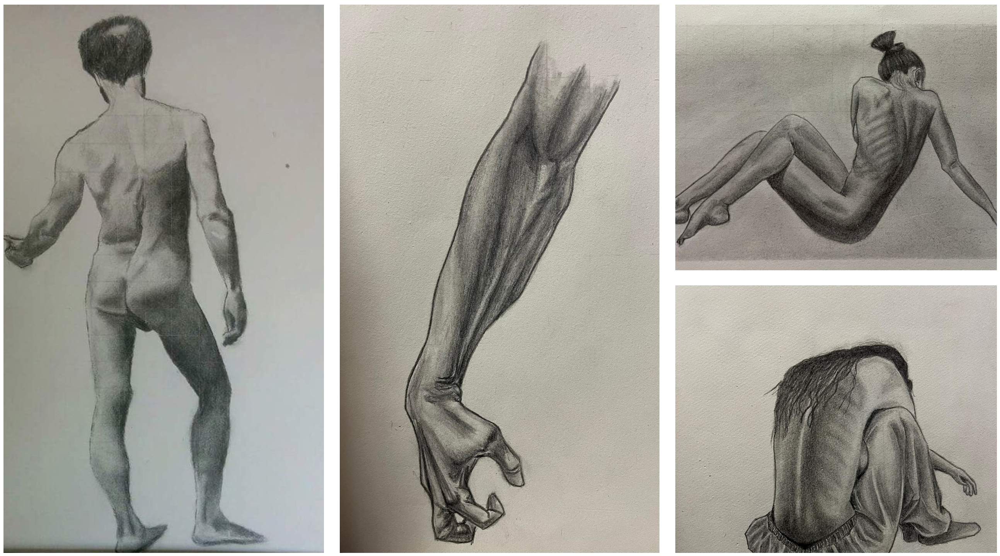
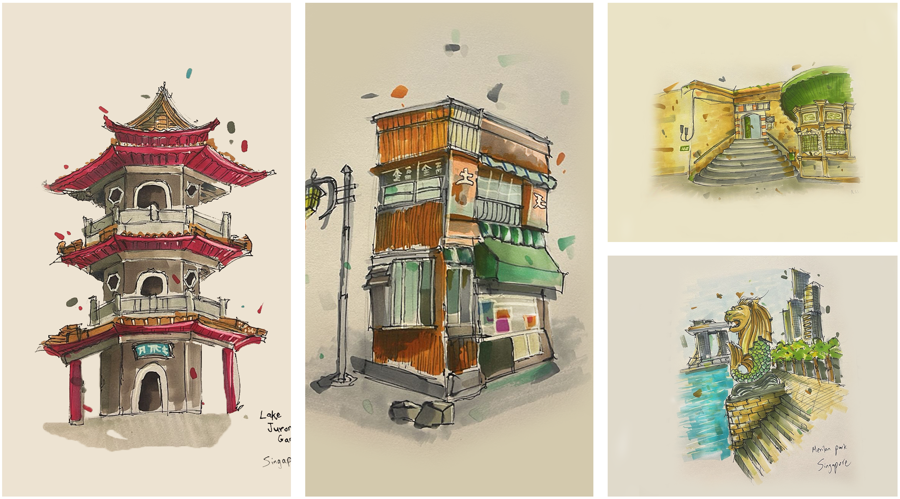
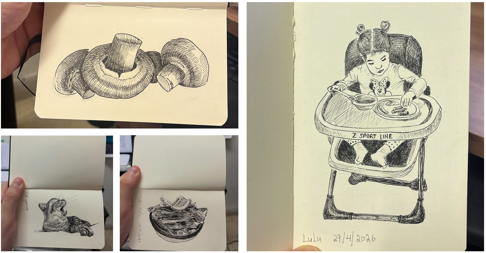

# Azmi Haider

**PhD researcher** at the University of Haifa, advised by [Dr. Dan Rosenbaum](https://danrsm.github.io/), working on computer vision and generative modeling with a focus on fast probabilistic inference and guided generation with token-based neural representations (expected graduation: August, 2026). Research includes controllable generative processes across modalities, including 3D scene understanding and view synthesis <a href="/PhD_Thesis.pdf">[thesis]</a>.
Before my PhD, I completed an M.Sc. <a href="/MSC_Dissertation___Forgery_Detection_in_Depth_Images.pdf">[thesis]</a> in computer science at the University of Haifa and a B.Sc. in electrical engineering at the Technion. During my B.Sc. and M.Sc., I worked at Intel Corporation as an intern in various computer vision and deep learning positions.

[Publications](https://scholar.google.com/citations?user=RyPu18oAAAAJ&hl=en)  &nbsp;&nbsp;&nbsp; [Contact](#contact) &nbsp;&nbsp;&nbsp; <a href="/Azmi_A_Haider_CV.pdf">CV</a>

  

I am interested in:
- Diffusion/flow-based generative models
- Learning continuous and discrete representations of continuous signals
- Fast amortized inference for probabilistic inference
- Computer vision with deep learning (representation learning, generative models)

---

## Research

**Direct Flow Neural Processes: Efficient Sampling via Flow Step Amortization** - In this [work](https://openreview.net/forum?id=7dkPGrmEMN) (ICML-W 2026), we introduce Direct Flow Neural Processes (D-FlowNP), a framework for efficient inference in flow-based Neural Processes. By amortizing iterative flow inference, D-FlowNP enables accurate posterior sampling using only a fraction of the original inference steps. Experiments on Gaussian processes, image completion, scientific datasets, and Bayesian optimization show that D-FlowNP achieves substantial speedups while maintaining the predictive quality of the underlying flow-based model.

**Predicting 3D Structure by Latent Posterior Sampling** - In this [work](https://arxiv.org/abs/2605.10830) (ICLR-W 2025), we combine a NeRF-based 3D scene representation with diffusion models to treat 3D reconstruction as probabilistic inference under uncertainty. We model the scene as a stochastic latent variable, learn a prior over latents with a diffusion model, and perform posterior sampling using score-based inference guided by a rendering-based likelihood term. Using a two-stage training pipeline (reconstruction model first, diffusion prior second), we demonstrate posterior sampling for reconstruction from diverse observation types, including single-view/multi-view images, noisy inputs, sparse pixels, and sparse depth, while capturing the varying uncertainty across these settings.

**Tokenized Neural Fields: Structured Representations of Continuous Signals** - In this [work](https://openreview.net/forum?id=41LUVIstlH) (NeurIPS-W 2025), we introduce Tokenized Neural Fields (TNF), a unified framework that represents continuous signals using a compact set of learnable tokens that interact with coordinate queries via cross-attention. By decoupling the representation from the decoder architecture, TNF enables scalable training across modalities, efficient adaptation to new signals, and probabilistic inference directly in token space. We validate TNF on 1D regression, 2D image reconstruction, and 3D scene modeling, achieving higher fidelity with fewer parameters than encoder- or latent-based baselines, and show emergent token specialization plus generative modeling when paired with diffusion transformers.

**What Can We Learn from Depth Camera Sensor Noise?** - In this [work](https://www.mdpi.com/1424-8220/22/14/5448) (Sensors 2022), we show that depth-camera sensor noise—often ignored or treated as something to denoise—contains rich information about the captured scene. From noise patterns alone, we can infer an object’s depth and location, identify the camera type (and even the specific device), and estimate scene cues such as light direction; we also demonstrate applications like distinguishing real vs. masked faces. Finally, we show that depth-shadow (missing-depth) size depends on scene geometry and can be used to authenticate an object’s placement in the scene.

**Forgery detection in 3D-sensor images** - In this [work](https://openaccess.thecvf.com/content_cvpr_2018_workshops/w32/html/Privman-Horesh_Forgery_Detection_in_CVPR_2018_paper.html) (CVPRW 2018), we introduce the problem of forgery detection in depth images as 3D cameras with depth sensors become increasingly common. We present an initial study showing that depth-image noise statistics can be leveraged for camera source identification and forgery detection. We also demonstrate that these noise cues can support depth reconstruction from noise.

---

## Fun Academic Projects

**Painter by Numbers ([Kaggle Competition](https://www.kaggle.com/c/painter-by-numbers))** — My solution to the Kaggle “Painter by Numbers” competition, where the goal is to learn an artist’s painting style. We used a Siamese (triplet) CNN with shared weights to learn an artist-style embedding. Each training step samples an anchor painting from artist A, a positive painting from the same artist A, and a negative painting from a different artist B. The network maps each image to a feature vector, and we train with triplet loss to pull anchor–positive embeddings closer while pushing anchor–negative embeddings farther apart, producing a feature space where each artist forms a cluster.
We also experimented with a contrastive (pairwise) Siamese CNN: given two paintings and a binary label (same artist / different artist), we use contrastive loss to minimize the distance for same-artist pairs and increase it for different-artist pairs. Pairs are sampled by first choosing the label, then selecting paintings accordingly (two from one artist vs. one from each of two artists).
[Code](https://github.com/AzmiHaider92/PainterByNumbers)

**Perfect-Loop GIFs with NeRF** — A small project to turn a GIF into a seamless “perfect loop” by reconstructing the scene with a NeRF and re-rendering frames along a closed camera path so the first and last frames match smoothly. Pipeline: extract frames → estimate camera poses with COLMAP → train NeRF with TensoRF → render along a circular loop → export the new GIF.
[Code](https://github.com/AzmiHaider92/Perfect-loop-gif-nerf)

**RL Agents for Breakout & CartPole** — Implemented reinforcement-learning agents to play Breakout and CartPole Atari games, training policies from interaction with the environment and evaluating learning curves and performance across runs.
[Code](https://github.com/AzmiHaider92/RL)

---

## Unplugged

When I'm away from the keyboard, I enjoy sketching with graphite pencils, fineliners, and markers. Here's a collection of some of that work.

  
  
<strong>Pencil drawings</strong> — Done with graphite pencils (HB, 2B, 4B). <a href="/pencil_gallery">See full gallery</a>

  
  
<strong>Urban Sketches Gallery</strong> — A tour of some of the places I sketched while visiting. Done with Pens and Markers. <a href="/urban_sketches_gallery">See full gallery</a>

  
  
<strong>Sketch Journal</strong> — Everyday items journaling. Done with Micron pens. <a href="/sketch_journal_gallery">See full gallery</a>

## Contact

azmi.haider92@gmail.com  
[Google Scholar](https://scholar.google.com/citations?user=RyPu18oAAAAJ&hl=en) · [GitHub](https://github.com/AzmiHaider92) · [LinkedIn](https://www.linkedin.com/in/azmi-haider-305383314/)

